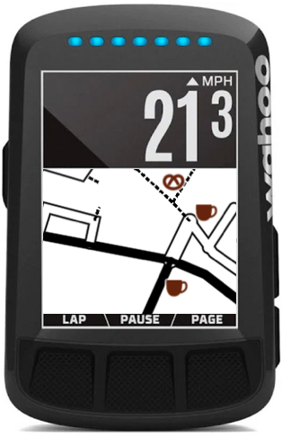
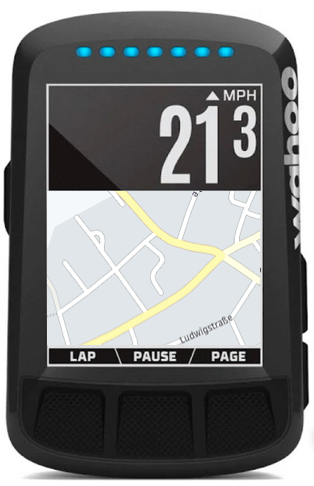
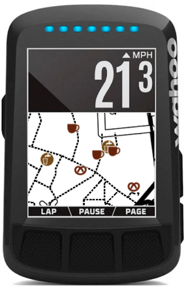

<div align="center">
    <p>
    
    
    
    </p>
    <p>
        <a href="https://img.shields.io/badge/python-v3.6+-blue.svg" alt="Python">
            </a>
        <a href="https://github.com/treee111/wahooMapsCreator/issues" alt="GitHub issues">
            </a>
        <a href="#sponsors" alt="Contributions welcome">
            </a>
    </p>
</div>

# wahooMapsCreator
wahooMapsCreator is a tool to create up-to-date maps for your Wahoo device. It supports BOLTv1, BOLTv2, ROAM, ROAMv2 and ELEMNT!

You can generate maps for the countries you like with latest OSM data and you can control which OSM-tags are included.

> why? The maps of your device may be old because Wahoo did not release a newer version in the last years.

## Get it running
The instructions are intended to be suitable for beginners.

If anything is unclear or seams wrong, write an [:pencil2: issue](https://github.com/treee111/wahooMapsCreator/issues)

## To start with...
1. [:rocket: Quick Start Guide to download and install required programs](docs/QUICKSTART_ANACONDA.md#download-and-install-required-programs)

2. [:computer: Run wahooMapsCreator - detailled usage description](docs/USAGE.md#usage-of-wahoomapscreator)

> In short: activate Anaconda environment, run wahooMapsCreator via CLI or via GUI.
```
conda activate gdal-user
python -m wahoomc cli -co malta
python -m wahoomc gui
```

3. [:floppy_disk: Copy the map-files to your device after generation](docs/COPY_TO_WAHOO.md#copy-maps-files-to-wahoo-device-)

## To further adjust...
* [:cookie: Get POIs displayed on your Wahoo](docs/USAGE.md#pois---points-of-interest)

* [:mount_fuji: Integrate contour lines into the generated maps](docs/USAGE.md#pois---points-of-interest)

* [:wrench: Control OSM tags to be included in your maps ](docs/USAGE.md#user-specific-configuration)

* [:computer: Preview your generated maps with cruiser ](docs/USAGE_CRUISER.md#usage-of-cruiser)


* [:mag: Use a custom theme on your Wahoo to control what and in which zoom-level certain elements are rendered](docs/TAGS_ON_MAP_AND_DEVICE.md#osm-tags-during-map-creation-and-on-your-device-)

## Contribution / Questions
You are welcome to provide input via Pull Requests, Issues or in any other way!
If you have trouble using wahooMapsCreator, look into the FAQ, write an issue or join the telegram channel
- [FAQ](docs/FAQ.md#frequently-asked-questions)
- [:pencil2: issue](https://github.com/treee111/wahooMapsCreator/issues)
- telegram channel: https://t.me/joinchat/TaMhjouxlsAzNWZk

More details can be found here: [CONTRIBUTING](docs/CONTRIBUTING.md#contributing-to-wahoomapscreator-)

## Thanks to
[@Intyre](https://github.com/Intyre)/Hank for the initial version of the script

[@Ebe66](https://github.com/Ebe66)/ebo for the Windows- port

[@mweirauch](https://github.com/mweirauch) for bringing in new ideas, testing and using the tool

[@zenziwerken](https://github.com/zenziwerken) for the work done for [POIs](https://github.com/zenziwerken/Bolt2-Mapsforge-Rendertheme)!

[@macdet](https://github.com/macdet) for bringing in new thoughts, testing and making this a little more public

[@vti](https://github.com/vti) for creating a GUI application to copy maps to wahoo and configure the device [POIs](https://github.com/vti/elemntary) as well as an [docker image](https://github.com/vti/wahooMapsCreator-docker) for wahooMapsCreator!