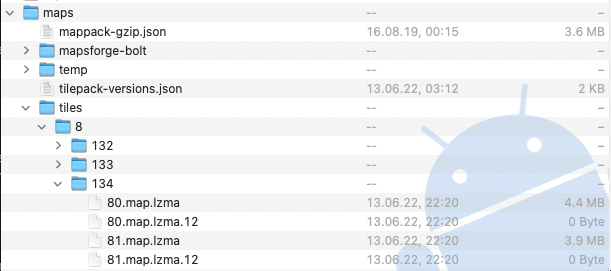

# Copy Maps files to Wahoo Device <!-- omit in toc -->

#### Table of contents <!-- omit in toc -->
- [Steps to carry out](#steps-to-carry-out)
  - [Location of the generated maps](#location-of-the-generated-maps)
  - [Tools to copy maps onto your Wahoo](#tools-to-copy-maps-onto-your-wahoo)
  - [Install ADB](#install-adb)
  - [Authorize Wahoo device](#authorize-wahoo-device)
  - [Copy map files](#copy-map-files)
  - [Copy device theme](#copy-device-theme)
- [POIs](#pois)
  - [Copy relevant files for POIs](#copy-relevant-files-for-pois)
  - [Activate VTM rendering](#activate-vtm-rendering)
- [Delete temp-files and Clear Cache](#delete-temp-files-and-clear-cache)

# Steps to carry out
## Location of the generated maps
The generated maps are saved in the user directory in folder: `$user_directory/wahooMapsCreatorData`.

There is a folder per country or for the X/Y combination with the relevant tiles.

## Tools to copy maps onto your Wahoo
There are some different tools you can use to copy the created files onto your device.
You always have to first [authorize to your Wahoo device](#authorize-wahoo-device).

- The most easy to use toll with a GUI would be the Elemntary app: https://github.com/vti/elemntary
- Windows
  - Copy via Windows built in MTP protocol . On windows you can navigate to the maps folder and drag new map files onto the folder called `maps/8` ([the Wahoo documentation](https://support.wahoofitness.com/hc/en-us/articles/115000127910-Connecting-ELEMNT-BOLT-ROAM-to-Desktop-or-Laptop-Computers))
  - GIU tool: https://github.com/hexadezi/adbGUI
- macOS
  - GUI tool: https://www.android.com/filetransfer/

## Install ADB
You can download the lates ADB-tools (included in the SDK Platform Tools) for your OS here:
https://developer.android.com/studio/releases/platform-tools

## Authorize Wahoo device
The Wahoo device must be authorized for ADB to be reachable from Windows and macOS. ADB authorization works different per Wahoo device and is decribed now.

1. disconnect device from your computer
2. turn the device on
3. press keys on device
   * **BOLT v1, ROAMv1, ELEMNT**
     * press the power button (you enter the settings menu)
     * press the power button again (you return to the normal screen)
   * **BOLT v2, ROAMv2**
     * press the power, up and down buttons at the same time
4. connect the device to your pc

Successful authorization can be tested via terminal / cmd:
```
adb devices
```

## Copy map files
The generated maps are stored in a folder per country or processed X/Y coordinates in this folder in your user account: `wahooMapsCreatorData`.

Copy the the whole content of the country- or X/Y folder or just the content of the containing X-folders (if the X-folder exists already) to `/ELEMNT-BOLT/maps/tiles/8` with a tool of your [choice](#tools-to-copy-maps-onto-your-wahoo).

After copying, it should look like that:



For another way of explanation, see [here](FAQ.md#where-on-my-wahoo-do-i-have-to-copy-the-maps)

## Copy device theme
In this repo, device themes are stored in folder `device_themes`. There are initial versions and adjusted versions. Both can be further changed to your requirements!

The following table shows the file per device and the location where the device theme needs to be copied to.

| device | rendering | file                 | location                                 |
| ------ | --------- | -------------------- | ---------------------------------------- |
| all    | VTM       | `vtm-elemnt.xml`     | `maps/vtm-elemnt/vtm-elemnt.xml`         |
| ROAM   | non-VTM   | `mapsforge-roam.xml` | `maps/mapsforge-roam/mapsforge-roam.xml` |
| BOLTv1 | non-VTM   | `mapsforge-bolt.xml` | `maps/mapsforge-bolt/mapsforge-bolt.xml` |
| ELEMNT | non-VTM   | ?                    | ?                                        |

Device themes are described [here](TAGS_ON_MAP_AND_DEVICE.md#Device-Theme)

# POIs
## Copy relevant files for POIs
For having POIs displayed on your device, you need to copy the icons and a corresponding device theme on your device.
These are the steps to follow:
- create folder `maps/vtm-elemnt`
- copy the content of  `device_themes/vtm_theme_poi` into  `maps/vtm-elemnt`.

## Activate VTM rendering
If you have a ROAM or BOLTv2, VTM is already the default rendering theme.
For e.g. a BOLTv1, you need to activete VTM rendering first.

- Create a empty file with this name `cfg_BHomeActivity_VtmMaps`
- Copy that file to the root-folder. It should be on the same level as the `maps` and `factory` folder.

# Delete temp-files and Clear Cache
- delete all files from \ELEMNT-BOLT\USB storage\maps\temp\
- to clear the cache and load the new maps on your Wahooo device:
1. `adb shell am broadcast -a com.wahoofitness.bolt.service.BMapManager.PURGE`
2. `adb shell am broadcast -a com.wahoofitness.bolt.service.BMapManager.RELOAD_MAP`
