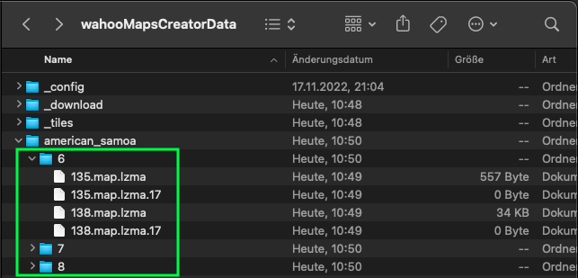
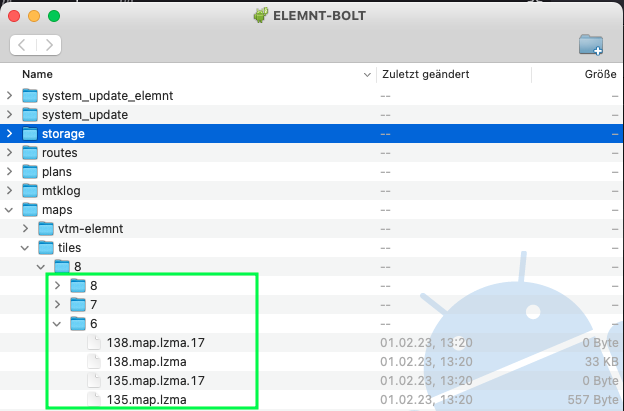

# Frequently asked questions<!-- omit in toc -->

- [Usage of wahooMapsCreator](#usage-of-wahoomapscreator)
  - [The tool stops but does not output an error](#the-tool-stops-but-does-not-output-an-error)
  - [I have a Java error. "Java heap space - out of memory"](#i-have-a-java-error-java-heap-space---out-of-memory)
  - [I have a Osmosis error. "Task type mw doesn't exist"](#i-have-a-osmosis-error-task-type-mw-doesnt-exist)
  - [How can I migrate from v3.x.x to v4.x.x?](#how-can-i-migrate-from-v3xx-to-v4xx)
- [Generated maps](#generated-maps)
  - [Where on my Wahoo device do I have to copy the maps?](#where-on-my-wahoo-device-do-i-have-to-copy-the-maps)
  - [How can I restore original maps?](#how-can-i-restore-original-maps)
  - [Can I preview my generated maps before putting them onto the Wahoo device?](#can-i-preview-my-generated-maps-before-putting-them-onto-the-wahoo-device)
  - [Does device/offline routing functionality use the new roads?](#does-deviceoffline-routing-functionality-use-the-new-roads)
  - [Are there already generated maps available for download?](#are-there-already-generated-maps-available-for-download)
- [Device theme](#device-theme)
  - [How can I restore original rendering layout?](#how-can-i-restore-original-rendering-layout)
- [Connection from Wahoo device to computer](#connection-from-wahoo-device-to-computer)
  - [I can't see my Wahoo device on my computer](#i-cant-see-my-wahoo-device-on-my-computer)


## Usage of wahooMapsCreator
### The tool stops but does not output an error
Run the tool and output debug logging messages.
Add the `-v` argument if running via CLI or set the checkbox on `Advanced settings` via GUI.

### I have a Java error. "Java heap space - out of memory" 
If you are on Windows and running out of memory, it can be that you just don't have enough memory OR that the memory limit of java 32 is the cause.

You identify a Java error when the console outputs `java.lang.OutOfMemoryError`.

There are some possible workarounds:
1. You can try to deinstall Java 32 and install the 64 bit version
2. Launch this command before running wahooMapsCreator helped here: https://github.com/treee111/wahooMapsCreator/issues/198
```
set JAVACMD_OPTIONS=-server -Xmx3G
```
3. A permanent workaround (in opposite to 2.) is making changes from this PR https://github.com/treee111/wahooMapsCreator/pull/171/files in the osmosis.bat file on your computer. This file located here: `wahooMapsCreatorData\_download\tooling_win\Osmosis\bin\osmosis.bat`.

### I have a Osmosis error. "Task type mw doesn't exist" 
You might have osmosis installed in version 0.49.0 or 0.49.1 and might be using macOS or Linux. If yes, this error occurs during creation of the .map files: 
```
org.openstreetmap.osmosis.core.OsmosisRuntimeException: Task type mw doesn't exist.
```

In these two versions 0.49.0 and 0.49.1, the feature we use for loading the mapwriter plugin was removed and just brought back in version 0.49.2.

You can list your version of osmosis on macOS/Linux with:
```
brew list osmosis
```

You can upgrade osmosis on macOS/Linux with:
```
brew upgrade osmosis
```

### How can I migrate from v3.x.x to v4.x.x?
You have to remove your existing environment:
```
conda env remove -n gdal-user
```
followed by creating a new environment and install wahoomc into:
```
conda create -n gdal-user python=3.10 geojson=2.5 gdal=3.6 requests=2.28 shapely=1.8 bs4=4.11 lxml=4.9 matplotlib=3.4.3 pip --channel conda-forge --override-channels
conda activate gdal-user
pip install wahoomc
```

## Generated maps
### Where on my Wahoo device do I have to copy the maps?
There is a directory named like the country or X/Y coordinates you processed in the `wahooMapsCreatorData` directory (see [docs](https://github.com/treee111/wahooMapsCreator/blob/develop/docs/COPY_TO_WAHOO.md#location-of-the-generated-maps)).
The content of this folder is relevant.

As an example, lets assume, we want to copy the maps of american_samoa



We need to copy the folders under the `american_samoa` directory into the `maps/tiles/8` directory on the Wahoo device (see [docs](https://github.com/treee111/wahooMapsCreator/blob/develop/docs/COPY_TO_WAHOO.md#copy-map-files)).

It should look like that after copying the files



If the folder, i.e. `maps/tiles/8/6` does already exist on your Wahoo device, copy the .map.lzma and .map.lzma.17 files into the existing folder.

### How can I restore original maps?
Delete all content from `maps/tiles/8` on your Wahoo device. After that, you can download original Wahoo maps from the ELEMNT mobile phone app again.

### Can I preview my generated maps before putting them onto the Wahoo device?
Read [usage of cruiser](USAGE_CRUISER.md#usage-of-cruiser)

### Does device/offline routing functionality use the new roads?
The device routing (synonym: offline routing) functionality is provided through routing tiles and available on newer models e.g. BOLTv2/ROAMv2. The routing tiles are stored in the directory `maps/routing` and contain all know roads which can be used to route over. This is something different then routes synced from Komoot, Stava, ... or planned via the ELEMNT Companion mobile app. In this case you follow a track, but on device routing will be used when you wonder off that track.

Without updating the routing tiles in addition to updating the generated map files, device routing of your device will not route you over the newly added roads in the maps. The reason is: The old routing tiles simply do not know about there existence.

Routing tiles are not covered in this repo for self generation but can be downloaded from https://1drv.ms/f/s!AgQ5_SDAjeL0eM8e4ViJIHdmOyU?e=wOQSQE. Download the <country>-routing.zip file for the countries of your choice and copy the content under the `maps/routing` directory on your wahoo device.

Examplary the germany routing tiles would be stored in `maps/routing/2/000/...` .

### Are there already generated maps available for download?
On this OneDrive, you'll find already generated maps for download: https://1drv.ms/f/s!AgQ5_SDAjeL0eM8e4ViJIHdmOyU?e=wOQSQE.

The content of these maps are slightly different from what you create with the default settings of wahooMapsCreator. Other than that this might be a good starting point to tryout and get them on your device. By customizing the settings you can then create your individual maps with wahooMapsCreator. 

## Device theme
### How can I restore original rendering layout?
If you render using VTM, delete this folder on your Wahoo device:  `maps/vtm-elemnt/vtm-elemnt.xml`.

If you do not render using VTM, delete this file `maps/mapsforge-roam/mapsforge-roam.xml` or `maps/mapsforge-bolt/mapsforge-bolt.xml`. Depending on which exists.

In addition, delete the empty file `cfg_BHomeActivity_VtmMaps` in the root directory of the Wahoo device if it exists.

## Connection from Wahoo device to computer
### I can't see my Wahoo device on my computer
If ADB does not seam to work with your PC and Wahoo:
- try to do the [Authorization](COPY_TO_WAHOO.md#authorize-wahoo-device) multiple times
- try another USB cable. Some cables do not support adb / file transfer

