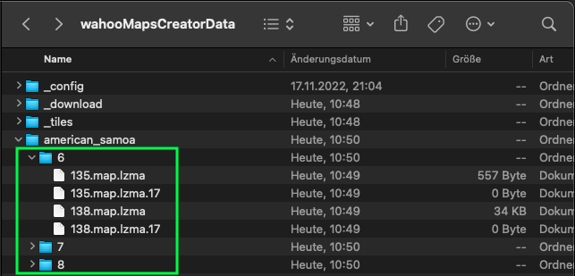
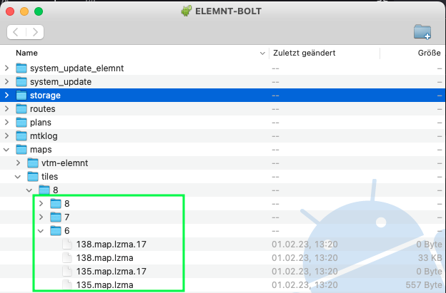

# Frequently asked questions<!-- omit in toc -->

- [Where on my wahoo do I have to copy the maps?](#where-on-my-wahoo-do-i-have-to-copy-the-maps)
- [How can I restore original maps?](#how-can-i-restore-original-maps)
- [How can I restore original rendering layout?](#how-can-i-restore-original-rendering-layout)

## Where on my Wahoo device do I have to copy the maps?
There is a directory named like the country or X/Y coordinates you processed in the `wahooMapsCreatorData` directory (see [docs](https://github.com/treee111/wahooMapsCreator/blob/develop/docs/COPY_TO_WAHOO.md#location-of-the-generated-maps)).
The content of this folder is relevant.

As an example, lets assume, we want to copy the maps of american_samoa

We need to copy the folders under the `american_samoa` directory into the `maps/tiles/8` directory on the Wahoo device (see [docs](https://github.com/treee111/wahooMapsCreator/blob/develop/docs/COPY_TO_WAHOO.md#copy-map-files)).

It should look like that after copying the files

If the folder, i.e. `maps/tiles/8/6` does already exist on your Wahoo device, copy the .map.lzma and .map.lzma.17 files into the existing folder.

## How can I restore original maps?
Delete all content from `maps/tiles/8` on your Wahoo device. After that, you can download original Wahoo maps from the ELEMNT mobile phone app again. 

## How can I restore original rendering layout?
If you render using VTM, delete this folder on your Wahoo device:  `maps/vtm-elemnt/vtm-elemnt.xml`.

If you do not render using VTM, delete this file `maps/mapsforge-roam/mapsforge-roam.xml` or `maps/mapsforge-bolt/mapsforge-bolt.xml`. Depending on which exists.

In addition, delete the empty file `cfg_BHomeActivity_VtmMaps` in the root directory of the Wahoo device if it exists.

# I can't see my Wahoo device on my computer
If ADB does not seam to work with your PC and Wahoo:
- try to do the [Authorization](COPY_TO_WAHOO.md#authorize-wahoo-device) multiple times
- try another USB cable. Some cables do not support adb / file transfer

# How can I preview my generated maps before putting them onto the Wahoo device?
Read [usage of cruiser](USAGE_CRUISER.md#usage-of-cruiser)
