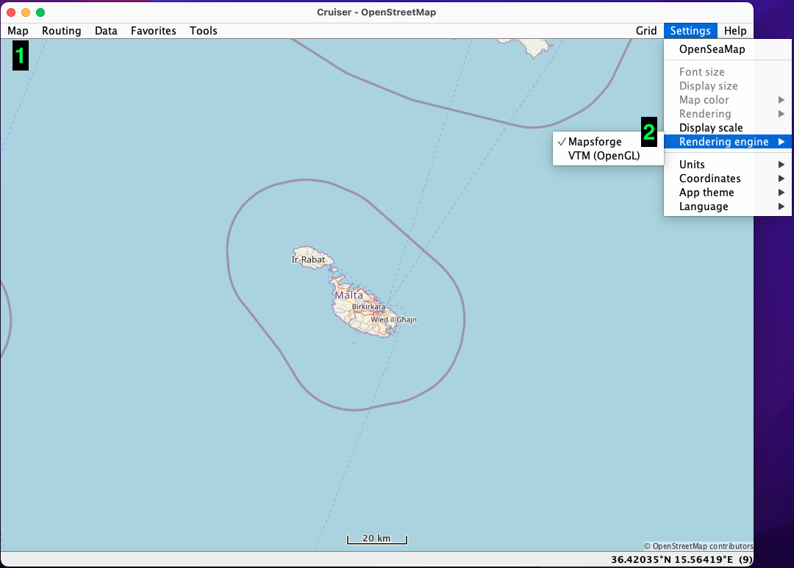
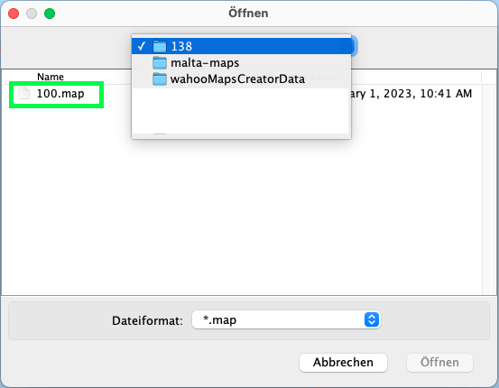
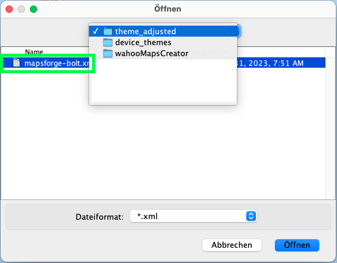

# Usage of cruiser <!-- omit in toc -->
- [Usage of cruiser](#usage-of-cruiser)
  - [Setting things up](#setting-things-up)
  - [Run cruiser](#run-cruiser)
  - [UI Elements](#ui-elements)
    - [Select rendering engine](#select-rendering-engine)
    - [Select map and device theme](#select-map-and-device-theme)

# Usage of cruiser
cruiser can be used to view the generated maps on your computer before copying them onto your Wahoo device. You'll select two things in cruiser: the generated .map file and the device theme.

By doing so, you can check if the wanted OSM elements are in your generated map files and if and how and the device theme will display them (and later on your Wahoo device).

## Setting things up
1. Download the latest cruiser version from: https://github.com/devemux86/cruiser/releases/latest and extract.

2. Create uncompressed maps for usage in cruiser. The map files you use for the Wahoo device are compressed and cannot be used in cruiser.

Either use `-c` CLI argument or set the checkbox in the Advanced settings when running the GUI.

## Run cruiser
Running cruiser is most simly by running `cruiser.jar`. Running the other files via command line is also possible

## UI Elements
You select maps and device themes with the Map menuitem `(1)`. Selecting the rendering engine can be established with Settings->Rendering engine `(2)`.

### Select rendering engine
Depending if you like to render VTM or non-VTM later on on your Wahoo device you need to choose either VTM rendering or Mapsforge.

Most probably you want to view POIs and therefore use VTM rendering.

### Select map and device theme
While creating the maps for cruiser, for e.g. `malta`, a folder called `malta-maps` was created. Choose a .map file of this folder for viewing in cruiser.

Choose a device theme of your choice.
- from within the repo in the directory `device_themes`
- from the downloaded device_themes.zip file
- on your computer adjusted to your needs

Depending of which rendering engine you use you need the vtm-element.xml or a non-VTM device theme.

This screenshot is for a non-VTM theme.

