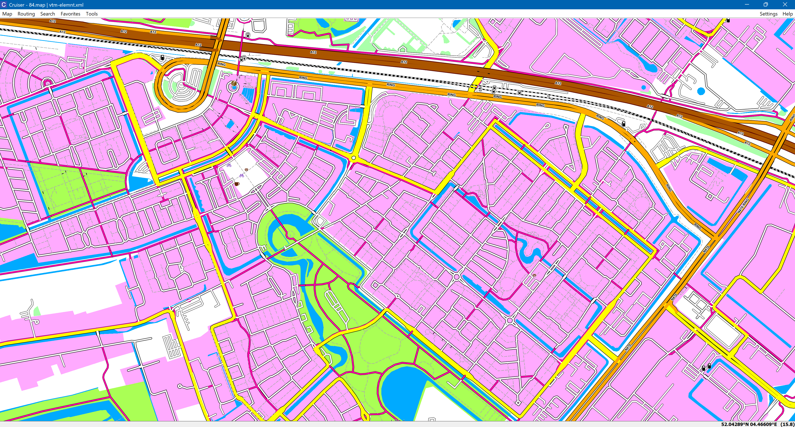
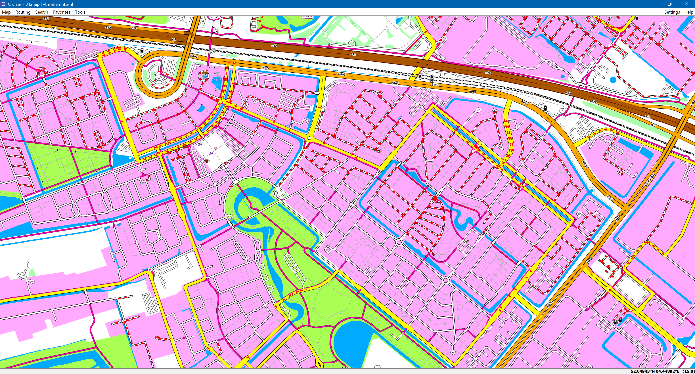

# Adding Wandrer data to the maps
## What is Wandrer?
Wandrer is a (paid)subscription service that keeps track of which roads you have cycled and/or walked and which you have not traveled (yet).
It does this by importing tracks from your (free) Strava account. A subscription to Strava is not needed.
The free, test, version of Wandrer is limited to 50 imported Strava tracks. 
More info is available in the Wandrer faq here: https://wandrer.earth/faq

The basic idea of Strava is to motivate you by letting you 'compete' against others, but let's be honest, there comes a time when you just know you are not going to be number 1 on speed or number of attempts anymore and the motivational push of Strava fades... 
Or it just doesn't do it for you anymore.

Enter Wandrer. Instead of competing against others you can try to ride every road in a city, state/region or country etc! The motivation is to get as much roads ridden as you can.
Instead of always riding the same old roads as always, explore new areas that turn out to be around the corner.
Better yet, you can still compete against others through the leaderbord system based on distance and percentage of an area covered.

## What does it look like?
Here you have a Cruiser screenshot of a map without Wandrer integration

    

    
    

With Wandrer integration the same map can look like this (depending on the theme used) Untraveled roads are show as red stippled. As you can see most of the roads on the upper side of this image are 'untraveled'.

    

    
    

An actual on device screenshot can look like this. Again untraveled roads in a red stipple.

    

    
    

## OK, great! I created a Wandrer account and everything from Strava is synced. How do I create these maps?
Of course you need to do the normal WahooMapsCreator installation first: 
[:rocket: Quick Start Guide to download and install required programs](docs/QUICKSTART_ANACONDA.md#download-and-install-required-programs)

And to get you a bit familiar with the program read the following link and generate a small country like Malta for example to make sure all is set up correctly and working: 
[:computer: Run wahooMapsCreator - detailled usage description](docs/USAGE.md#usage-of-wahoomapscreator)

Next, go to the Wandrer website and open up the 'Big Map' view. Zoom in/out until the display shows the region you want to have integrated in your maps AND the download icon in the right side bar (see pointer in next image) isn't greyed out any more.
If it is greyed out, zoom in until it turns solid. If needed you can integrate multiple Wandrer maps to your map to cover a larger area or add other area's.
Now press the download icon the pointer in the next image is pointing at and take over the settings show.

    

    
    

After pressing 'Continue' the Wandrer site will start creating your download file. When it is ready you will get an email with a download link and some additional information.

## Phew, pulled it of, whats next?
Copy the downloaded Wandrer KMZ file(s) to the _downloads\maps folder of your WahooMapsCreator installation without changing the filenames(!) and create the map for your desired region or x/y tile as normal. 
Make sure to enable the "Integrate Wandrer files" on the Advanced settings tab when using the gui or add the -dw command line option when using the cli.

Thats it.

Now upload the generated maps to your device as usual. 
If you are not using it already, try out VTI's Elemntary app for the uploads. It makes doing these kind of things so very much easier than by using abd https://github.com/vti/elemntary
One note on it though, do not use the settings in the Hidden features section. MAP_PAN_ZOOM just does not work anymore after a Wahoo firmware update and only use VTM_RENDERING on a v1 device. i.e. Elemntary, Bolt 1 or Roam 1.
If you do use it on a unit that already uses VTM rendering (all >v1 units) it will revert to acting like a v1 unit!!!

For people with existing installs of WahooMapsCreator, make sure to use the updated versions of tags-to-keep.json, tag-wahoo-poi.xml and the theme vtm_theme_poi\vtm-elemnt.xml. 

If you want to keep your own version of any of these files you need to update them with the, few, changes made in these files which are easily found by searching them for "wandrer"

## Good to know:
The Wandrer kmz files you put in the maps folder are converted to osm.pbf files and the kmz file is renamed to processed-(wandrer file name). 
The map, when on your device, is of cource not dynamically updated. i.e. untraveled red stippled roads will <b>NOT</b> magically turn 'unstippled' on the device after you ride them. 
To update the untravelled status of roads you will need to re-download the region from Wandrer and re-generate the map. 
When copying the new kmz file to the maps directory don't forget to remove the now obsolete old wandrer.osm.pbf file(s)!

Multiple Wandrer files are supported but all must be added and processed in one run or be completely part of another tile. Why? two reasons, you can very easily get into the situation where 
two files have a, part of, the same region. An older file can have some roads marked as untraveled and a newer file can than have the same roads marked as traveled.
The result is a conflict and most likely the roads will still be shown as untraveled. 

The other reason is more technical and more important. The osm.pbf files generated from the KML files by GPSBabel during the conversion to osm.pbf have negative way id's. 
All converted files start with an id of -1  and so on which when using multiple files is a big no no. 
Multiple identical id's are not allowed. 

Also some of the tools used can't handle negative id's. So during the conversion process these negative id's are converted to big positive numbers. 
When converting multiple files in one run this numbering is continued among the multiple input files (if there are that is). 
But each new run of WMC starts with the same large positive number again. So if you have Wandrer-file-a converted in one run and Wandrer-file-b in a next run they will again 
use the same id's and it won't work (unless they cover area's from an other tile all together)

Managing the Wandrer files in the maps folder is up to you.

